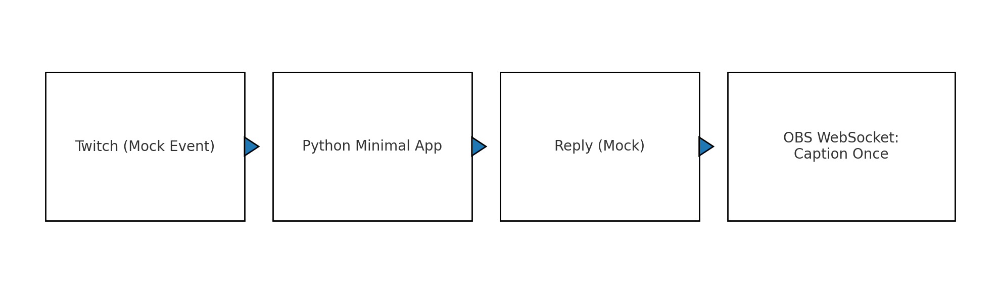

# Kamyu Case Study — Twitch→LLM→TTS→(字幕) Minimal Demo

> ⚠️ **非商用デモのみ**。商用利用・再配布は禁止。販売版の実装は含みません。

## TL;DR
- Twitchコメントを**模擬イベント**で受け取り → 簡易応答を生成
- （任意）OBSへ字幕を**1回だけ**送る最小デモ
- 目的：**実装力の証明**（構成・最小コード）。**商用版の中身は公開しない**

## Architecture（簡易説明）
- 入力：Twitch（モックイベント）
- 処理：Python最小アプリで簡易応答を生成
- 出力：（任意）OBS WebSocketで字幕を一度だけ送る
- 

## Quickstart
```powershell
# Windows
.\.venv\Scripts\Activate.ps1
pip install -r requirements.txt
Copy-Item .env.example .env
python src/main.py
# 任意：ダミー送信
python src/optional_obs_caption.py
```

## License
See [LICENSE-SAMPLE.md](LICENSE-SAMPLE.md)（デモ用途限定・商用不可）。
